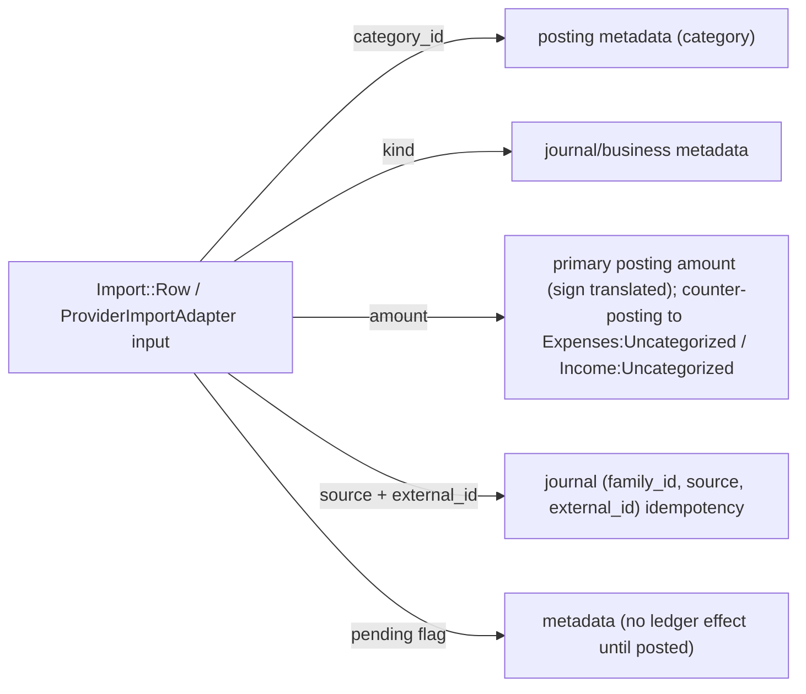

# Accounting Mapping — Current Sure → New Double-Entry Model

Maps every current accounting concept to its proposed counterpart, with source
references and a required action. Hypotheses from Spike 1 are verified against the
repository (`spikes/double_entry/README.md`).

Legend: **Keep** = unchanged; **Adapt** = small changes; **Replace** = reimplement
on the ledger; **Remove** = deleted.

---

## Core mapping

| Current Sure | New Accounting | Action | Evidence |
|---|---|---|---|
| `Account` (chart node) | `Accounting::Account` | Keep + adapt | `app/models/account.rb:21`, `db/schema.rb:99` |
| `Account#classification` (asset/liability) | `Accounting::AccountType` | Adapt | `app/models/account.rb:42`, visible `db/schema.rb:105` |
| `Entry` | `Posting` | Replace semantics | `app/models/entry.rb:11` (single signed leg) |
| `Transaction` | Business metadata on a `JournalEntry` leg | Keep + adapt | `app/models/transaction.rb:70` |
| `Transfer` | Balanced `JournalEntry` (two asset postings) | **Remove primitive** | `app/models/transfer.rb:2`, `db/schema.rb:2752` |
| `Valuation` `opening_anchor` | Opening posting to `Equity:Opening-Balances` | Replace | `app/models/valuation.rb:4`, `app/models/account/opening_balance_manager.rb:69` |
| `Valuation` `current_anchor` | `BalanceObservation` (+ optional adjustment journal) | Replace | `app/models/account/current_balance_manager.rb:185` |
| `Valuation` `reconciliation` | `BalanceObservation` + `Accounting::Reconciliation` | Replace | `app/models/account/reconciliation_manager.rb:88` |
| `Balance` (materialized) | Derived posting cache (same shape) | Keep as cache | `app/models/balance.rb`, `app/models/balance/materializer.rb:16` |
| `flows_factor` | `Accounting::AccountType#normal_balance` | **Remove column/machinery** | `db/schema.rb:269`, `app/models/balance/base_calculator.rb:70` |
| `Category` | Income/Expense ledger account + posting metadata | Evaluate (see below) | `app/models/category.rb`, `db/schema.rb:405` |
| `Transaction#kind` | Business/reporting metadata | Adapt | `app/models/transaction.rb:70` |
| `Rule` | Rule (classifies postings) | Keep + adapt | `app/models/rule.rb:78` |
| `Import` → `Entry` | Import → balanced journal | Adapt | `app/models/import.rb`, `app/models/transaction_import.rb:57` |
| `Trade` | Journal with security postings | Adapt | `app/models/trade.rb:7` |
| `Holding` / `MarketDataImporter` | Mark-to-market journal postings | Adapt | `app/models/holding/materializer.rb`, `app/models/account/market_data_importer.rb` |
| `ExchangeRate` / `Money#exchange_to` | FX conversion for multi-currency journals | Keep | `app/models/exchange_rate.rb`, `lib/money.rb:49` |
| `RejectedTransfer` | Matching hint only | Keep (hint) | `app/models/rejected_transfer.rb` |
| `Account::ProviderImportAdapter` | Provider → ledger adapter | Adapt (persistence call only) | `app/models/account/provider_import_adapter.rb:47` |
| `Entry#reconciled_at` / statement reconciliation | Observation-based reconciliation | Adapt | `app/models/entry.rb:317`, `app/models/account_statement.rb` |

---

## Entry → Posting (detail)

`Entry` is already exactly a posting: `account_id` + signed `amount` + `currency` +
`date` (`app/models/entry.rb`, `db/schema.rb:702`). The changes:

1. Add `journal_id` to `entries` (or introduce `postings` and project to
   `entries`; see `IMPLEMENTATION_PLAN.md` Phase 1 decision).
2. Guarantee that every business event writes ≥2 entries (postings) that sum to
   zero, enforced by `Accounting::Ledger`.
3. Split-out meaning: the **existing** `Entry#amount` sign convention (negative =
   inflow) is preserved at the projection layer, and translated to debit-positive
   postings inside the ledger (see "Sign convention").

Reused `Entry` features that stay:

- `entryable` delegation (`app/models/entryable.rb:12`)
- splits (`app/models/entry.rb:438`–`:494`)
- import provenance + `import_locked` (`:313`, `:357`)
- pending flags (`:68`)
- reconciliation state (`:317`–`:351`)
- idempotency `(account_id, source, external_id)` and `(account_id, idempotency_key)`
  (`db/schema.rb:728`, `:730`)

## Transaction → Journal leg metadata

`Transaction` keeps `category_id`, `merchant_id`, `tags`, `name`, `notes`,
`extra`, `investment_activity_label`. It loses `transfer_id`
(`db/schema.rb:2740`) and the `kind` values that only existed to encode transfer
semantics (`TRANSFER_KINDS`, `app/models/transaction.rb:81`). `kind` may survive as
a reporting policy (see `BUDGET_EXCLUDED_KINDS`, `:86`), but the ledger no longer
depends on it for balancing.

## Transfer → Balanced transaction (detail)

Current links that must be traced and removed:

| Reference | File |
|---|---|
| `Transfer` associations | `app/models/transfer.rb:2-5` |
| `has_one :transfer_as_inflow/outflow` | `app/models/transaction/transferable.rb:5-6` |
| `Transaction#transfer` | `app/models/transaction/transferable.rb:13` |
| Manual creation | `app/models/transfer/creator.rb:28` |
| Auto matching SQL | `app/models/family/auto_transfer_matchable.rb:215` |
| Rule action | `app/models/rule/action_executor/set_as_transfer_or_payment.rb` |
| `transfer_id` column | `db/schema.rb:2740` |
| `transfers` table | `db/schema.rb:2752` |
| API serialization | `app/views/api/v1/transfers/_transfer.json.jbuilder` |
| API transaction transfer block | `app/views/api/v1/transactions/_transaction.json.jbuilder:62` |
| UI | `app/views/transfers/*`, `app/views/transfer_matches/*`, `app/views/transactions/_transaction.html.erb:143` |
| Controllers | `app/controllers/transfers_controller.rb`, `app/controllers/transfer_matches_controller.rb` |
| Account cleanup | `app/models/account.rb:775` (`cleanup_transfers`) |

New representation: `Accounting::Ledger.transfer(from:, to:, amount:, ...)` →
one `JournalEntry` with two asset postings. Transfer *detection*
(`Family::AutoTransferMatchable#transfer_match_candidates`,
`app/models/family/auto_transfer_matchable.rb:32`) is retained and returns
candidate pairs; confirming a candidate calls `Ledger#transfer`.

## Valuation anchors → postings + observations (detail)

| Anchor | Where created | New representation |
|---|---|---|
| `opening_anchor` | `app/models/account/opening_balance_manager.rb:69` | Opening posting vs `Equity:Opening-Balances` |
| `current_anchor` | `app/models/account/current_balance_manager.rb:185` | `BalanceObservation` (never a ledger write); adjustment only via `Ledger#adjust` |
| `reconciliation` | `app/models/account/reconciliation_manager.rb:88` | `BalanceObservation` + `Accounting::Reconciliation`; optional explicit adjustment journal |

Consumers to re-home:

- `Account::Anchorable` (`app/models/account/anchorable.rb`) accessors
  (`opening_anchor_date`, `opening_anchor_balance`, `current_anchor_balance`,
  `has_*_anchor?`) are used by `Balance::BaseCalculator`, `ForwardCalculator`,
  `ReverseCalculator`, `HistoryStartDate`, and views. Replace with
  `Accounting::Ledger#opening_balance` / `opening_date`.
- `GoalPledge::Reconciler` is invoked from `ReconciliationManager`
  (`app/models/account/reconciliation_manager.rb:19`); re-home to the observation
  writer.
- `Entry#reconciliation_state`/`mark_reconciled!`
  (`app/models/entry.rb:317`–`:351`) is statement-level reconciliation and can
  remain, now driven by observations rather than anchors.

## Balance → derived cache (detail)

Keep the `balances` table and its consumers, but change the *source*:

- Before: entries + opening/current anchors
  (`app/models/balance/forward_calculator.rb:24` valuation override,
  `app/models/balance/reverse_calculator.rb`).
- After: postings + opening postings. The valuation-override branch
  (`forward_calculator.rb:24`–`:33`) is replaced by summing postings, so no
  absolute override exists.
- `accounts.balance`/`cash_balance` remain caches written by
  `Balance::Materializer#update_account_info`
  (`app/models/balance/materializer.rb:55`).

## flows_factor → account type semantics

`flows_factor` (`db/schema.rb:269`) is the persisted sign `asset ? 1 : -1`
(`app/models/balance/base_calculator.rb:70`) and is exposed in
`app/views/api/v1/balances/_balance.json.jbuilder:6`. Replace with
`Accounting::AccountType#normal_balance`. The stored virtual columns
`end_balance`/`end_cash_balance`/`end_non_cash_balance`
(`db/schema.rb:266`–`:274`) embed `flows_factor` and must be rewritten.

## Category: account vs metadata (evaluation)

Do **not** assume categories become accounting accounts. Trade-offs:

| Option | Effect on budgets/reports | Recommendation |
|---|---|---|
| **A. Category = income/expense account; `category_id` removed** | Budget/report SQL rewritten to account hierarchy; merchant analytics change | Pragmatic in a pure ledger, invasive for Sure |
| **B. Category stays `category_id` metadata; ledger uses hidden synthetic Income/Expense accounts for balancing** | Budgets/reports unchanged; UI unchanged | **Recommended** |
| **C. Coexist: category is a real account and also copied to metadata** | Duplication/drift risk | Rejected |

Under **B**, an imported expense posts
`Expenses:Uncategorized` (hidden) against the asset account, while
`transactions.category_id` still points at the user's `Food` category for UI and
reports. When the user categorizes, the ledger either (a) keeps the hidden account
and treats `category_id` purely as metadata (simplest, recommended for MVP), or
(b) posts a reclassification journal later (Phase 10/11). Sure's synthetic
`Category.uncategorized` (`app/models/category.rb:236`) maps to
`Expenses:Uncategorized`; `Category.other_investments` (`:244`) maps to an
investment expense account.

## Import mapping



## Investment mapping (risk area)

| Operation | New representation |
|---|---|
| Buy security | Journal: `Assets:Brokerage:Security` +qty value / `Assets:Brokerage:Cash` −cost (+ fees) |
| Sell security | Journal: cash +net / security −cost / realized gain/loss to `Income:Capital-Gains` |
| Dividend / Interest | Journal: cash + / `Income:Dividends` − |
| Market valuation | Explicit mark-to-market journal: `Assets:Brokerage:Security` ± / `Equity:Market-Gains` ∓ (posted by `Holding::Materializer`) |
| Cash transfer to brokerage | Ordinary transfer journal (two asset postings) |
| Fee | Journal: `Expenses:Fees` + / cash − |

`net_market_flows` (`db/schema.rb:270`, used by goals via
`app/models/investment_statement.rb:179`) is derived from mark-to-market postings.

## Multi-currency mapping

| Case | Rule |
|---|---|
| Single-currency journal | `sum(postings) == 0` in that currency |
| Multi-currency cash transfer | Two journals, or one journal with an FX gain/loss leg such that each currency context sums to zero |
| FX conversion | Explicit conversion postings using `ExchangeRate`/`Money#exchange_to` (`lib/money.rb:49`) |
| FX gain/loss | Dedicated `Income:FX-Gain/Loss` account posting |

The ledger must not silently assume rate `1`; a missing rate is an error or an
explicit suspense posting, matching the strictness already in
`app/models/trade.rb:256` (`converted_to_basis_currency`).

## Sign convention (cross-cutting)

Sure (cash) convention: `Entry#amount` negative = inflow, positive = outflow
(`docs/llm-guides/architecture.md`); liabilities stored positive
(`app/models/account.rb`; `Balance::BaseCalculator#flows_factor`).
Ledger convention: debit-positive, liabilities/income/equity negative
(`spikes/double_entry/lib/double_entry/account_type.rb`).

Translation must live in exactly one place at the boundary:

```ruby
# conceptual: Sure's sign already encodes the balance direction, so the
# real-account posting is a pure negation; the counter-posting balances.
Accounting::SignConvention.to_ledger(entry_amount) # => -entry_amount
```

All write paths and the materializer use it; net worth and account-balance tests
must assert equality across both conventions.
