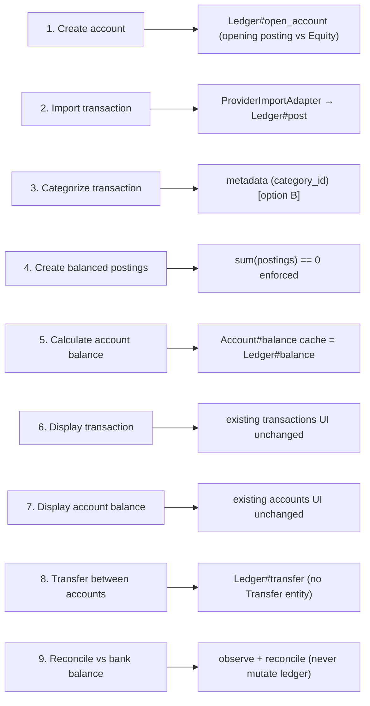

# Implementation Plan — New Accounting Engine (Fresh Sure Fork)

Assumptions, per the spike brief:

```text
No existing financial data
No migration
No backwards compatibility
No need to preserve the current accounting database schema
```

Goal: a fresh installation boots directly on the double-entry ledger while the
existing UI, `/api/v1`, and most of Sure keep working.

Guiding rules:
- Keep one accounting boundary: `Accounting::Ledger`.
- Keep `entries`/`balances` as projections/caches so consumers and raw SQL stay green.
- Delete `Transfer`, anchor managers and `flows_factor` only after the ledger
  proves the invariants under test.
- Never adjust a balance to hide a discrepancy; post an explicit correction.

---

## Decision to settle first: `postings` table vs reuse `entries`

Two viable shapes:

- **P1 — Reuse `entries` as postings.** Add `journal_id` to `entries`; every
  business event writes ≥2 `Entry` rows summing to zero. Pro: all raw SQL and
  consumers (`IncomeStatement`, search, recurring, budgets, goals) keep working
  with zero changes. Con: an `Entry` now sometimes belongs to a non-UI
  counter-account, so scopes must exclude counter-postings from UI lists.
- **P2 — New `postings` table + projection.** Ledger-owned `postings`; a
  projection materializes the existing `entries`/`transactions` read models.
  Pro: clean separation. Con: double-write/projection complexity and a rebuild
  path for every read.

**Recommendation: P1.** It turns the existing single-entry table into the posting
table with the minimum blast radius, and it matches the spike's finding that
`Entry` is already a posting. P2 remains the escape hatch if counter-posting
leakage proves unmanageable.

---

## Phase 0 — Bootstrap & guardrails

- Add `Accounting::Money` and port the spike's 24 property tests
  (`spikes/double_entry/test/double_entry_test.rb`) to run against the boundary.
- Add a `Family`/installation seed that creates the synthetic accounts:
  `Equity:Opening-Balances`, `Expenses:Uncategorized`, `Income:Uncategorized`,
  `Assets:Suspense`, `Income:FX-Gain/Loss`, `Income:Capital-Gains`,
  `Expenses:Fees`, `Expenses:Bank-Adjustment`.
- Add a CI invariant check: `sum(all postings) == 0` for any test database
  created by fixtures/factories.
- **Exit:** ledger domain unit tests pass; no schema change yet.

## Phase 1 — New accounting schema

- Migration (fresh install, current Rails version):
  - `journals` (`SPIKE_2.md` "Database Design").
  - `entries.journal_id` nullable + index; backfill impossible (fresh DB).
  - `balance_observations` table.
  - Drop `transfers` table, `transactions.transfer_id`, `balances.flows_factor`
    (and rewrite the virtual `end_*` columns without `flows_factor`).
  - Drop `valuations` anchor `kind` values (keep table if `Valuation` remains as a
    projection, else remove).
- **Exit:** schema loads clean; no application code depends on dropped columns yet.

## Phase 2 — Domain model (`Accounting::*`)

- Implement `Accounting::{Ledger,Account,AccountType,Posting,JournalEntry,Reconciliation,Money,errors}`.
- AR-backed `Ledger` + reuse the spike's in-memory `Ledger` as the reference.
- `Ledger#post`, `#transfer`, `#reverse`, `#open_account`, `#observe_balance`,
  `#reconcile`, `#adjust`; queries `#balance`, `#balance_at`, `#opening_balance`,
  `#transactions`, `#postings`, `#net_worth`.
- Sign translation helpers (Sure ⇄ ledger) in one module.
- **Exit:** boundary tests green (balance == opening + sum(postings); unbalanced
  rejected; reconciliation never writes).

## Phase 3 — Transaction / posting API

- `TransactionsController#create/#update` (`app/controllers/transactions_controller.rb:133`)
  and `Api::V1::TransactionsController` post a balanced journal instead of a
  single `Entry`: the asset/liability leg plus an `Expenses:Uncategorized` /
  `Income:Uncategorized` counter-leg.
- Keep `Account::ProviderImportAdapter#import_transaction`
  (`app/models/account/provider_import_adapter.rb:47`) signature stable; change
  only its persistence step to `Ledger#post`, preserving idempotency and pending
  claiming.
- Splits (`app/models/entry.rb:450`) become multiple expense postings under one
  journal.
- **Exit:** create/edit/split a transaction through the UI and API; ledger stays
  balanced; existing transaction tests pass.

## Phase 4 — Accounts (chart of accounts)

- Map `accountable_type`/`classification` to `Accounting::AccountType`.
- Replace `Account#set_opening_anchor_balance`
  (`app/models/account/anchorable.rb:12`) with `Ledger#open_account`.
- Replace `Account#opening_anchor_*`/`current_anchor_*` accessors with ledger
  queries; update `Balance::BaseCalculator#calculation_start_date`
  (`app/models/balance/base_calculator.rb:34`) to use the opening posting date.
- **Exit:** create an account with an opening balance; `accounts.balance` matches
  `Ledger#balance`; net worth correct on both conventions.

## Phase 5 — Imports

- CSV/statement importers (`app/models/transaction_import.rb:57`, `QifImport`,
  `PdfImport`, `MintImport`, `YnabImport`, `ActualImport`, `SureImport`) post
  balanced journals.
- Provider balance snapshots write `balance_observations`, not anchors
  (replace `app/models/account/provider_import_adapter.rb:411` and
  `Account#set_current_balance`).
- **Exit:** import a CSV and a provider sync; ledger balanced; duplicates
  idempotent; account list/detail unchanged.

## Phase 6 — Rules

- Keep `Rule` matching/actions; adapt
  `Rule::ActionExecutor::SetAsTransferOrPayment` to build a balanced transfer
  journal.
- Category/merchant/tag/name/exclude actions remain metadata mutations (mapping
  option B).
- **Exit:** rules apply; the transfer rule produces a balanced journal with no
  `Transfer` row.

## Phase 7 — Transfers

- Delete `Transfer`/`RejectedTransfer` model + `transfers` table +
  `transactions.transfer_id` + `Transaction::Transferable`.
- `Transfer::Creator` → `Accounting::Ledger#transfer` (keep fees as separate
  journals).
- Keep `Family::AutoTransferMatchable#transfer_match_candidates` as a detector;
  confirming calls `Ledger#transfer`.
- Update `transfers_controller`, `transfer_matches_controller`, `transfers`
  jbuilder, and the transaction transfer block
  (`app/views/api/v1/transactions/_transaction.json.jbuilder:62`) to derive the
  counterpart from the journal.
- **Exit:** create and match transfers through UI/API; no `Transfer` references
  remain (`rg 'Transfer' app` is empty of accounting uses).

## Phase 8 — Balances

- Rewrite `Balance::ForwardCalculator`/`ReverseCalculator`/`BaseCalculator` to
  derive from postings, removing the valuation-override branch
  (`app/models/balance/forward_calculator.rb:24`).
- `Balance::Materializer` unchanged in shape; it now reads postings
  (`app/models/balance/materializer.rb:16`).
- Remove `flows_factor` usage; keep `balances` virtual columns redefined without
  it.
- **Exit:** daily balances match `Ledger#balance_at`; charts/reports unchanged.

## Phase 9 — Reconciliation

- `Account::ReconciliationManager` replaced by `Ledger#observe_balance` +
  `#reconcile` + optional `#adjust`.
- Re-home `GoalPledge::Reconciler`
  (`app/models/account/reconciliation_manager.rb:19`).
- Keep `Entry#reconciled_at`/`Entry#reconciliation_state`
  (`app/models/entry.rb:317`) for statement-level marking.
- **Exit:** reconcile to an external balance; a mismatch reports a discrepancy and
  never mutates the ledger; correcting it posts an explicit adjustment journal.

## Phase 10 — Reports / budgets

- Verify `IncomeStatement` (`app/models/income_statement/scoped_transactions_query.rb:27`),
  `BalanceSheet`, `Budget`, `Goal` against the P1 projection.
- The synthetic `Expenses:Uncategorized`/`Income:Uncategorized` accounts must not
  appear as user categories; keep `category_id` as the UI source.
- **Exit:** dashboard, reports, budgets, goals visually identical in system tests.

## Phase 11 — Investments / FX

- Post security buy/sell/dividend/interest journals (see mapping doc).
- Mark-to-market journal posted by `Holding::Materializer`; feed
  `net_market_flows`.
- Multi-currency: require offsetting FX legs so each currency context sums to
  zero; explicit `Income:FX-Gain/Loss`.
- **Exit:** investment reports reconcile with the ledger; cross-currency transfer
  balances per currency.

---

## Minimum viable implementation (first milestone)

The smallest end-to-end slice that boots a fresh Sure install and demonstrates the
brief's 9 steps:



Deliver phases 0–5 and 7–9 for the milestone; defer 6, 10, 11.

---

## Verification

- Port the spike suite to `Accounting::Ledger` (Minitest model tests).
- System tests: `DISABLE_PARALLELIZATION=true bin/rails test:system` for accounts,
  transactions, transfers, reconciliation.
- API: Minitest behavioral coverage + documentation-only rswag specs; regenerate
  `docs/api/openapi.yaml` for changed fields.
- Pre-PR checklist: `bin/rails test`, `bin/rubocop`, `erb_lint`, `npm run lint`,
  Brakeman (see `docs/llm-guides/development.md`).
- Add an invariant assertion in test setup: `sum(all postings) == 0`.

---

## Explicit non-goals

- No migration/backfill/dual-write/feature flags for old data.
- No production-grade investment or FX engine in this spike.
- No bank-provider integration work beyond re-pointing the adapter.
- No mobile or Helm changes beyond API-contract compatibility.
- No reconciliation UI redesign beyond wiring observations.
- No performance optimization beyond keeping the `balances` cache.
