# Spike 2 — Replacing Sure's Accounting Engine (Fresh Install)

Companion documents:
- `ACCOUNTING_BOUNDARY.md` — the proposed interface between Sure and the ledger.
- `ACCOUNTING_MAPPING.md` — current-concept → new-concept mapping with source references.
- `UI_COMPATIBILITY.md` — per-screen/per-feature UI impact.
- `IMPLEMENTATION_PLAN.md` — phased build plan for a fresh fork.

Prior art: `spikes/double_entry/` (standalone ledger, its `README.md`, and Spike 1's
assessment). This spike re-verifies the prior art against the actual repository.

Scope note: this document is architecture only. It assumes a **fresh, empty database**.
It deliberately contains **no migration/backfill/dual-write/feature-flag plan** for
existing financial data.

---

## Executive Summary

> **Can we replace Sure's accounting engine while retaining the existing UI?**

**MOSTLY YES.**

Sure's accounting surface is already shaped like a partial double-entry ledger: a
`Transaction` (business event) owns exactly one `Entry`, and an `Entry` is a
single signed leg (`account_id`, `amount`, `currency`, `date`) — see
`app/models/entry.rb:11`, `app/models/entryable.rb:12`. What is missing is the
**balancing leg** and an authoritative `sum(legs) == 0` rule; today the books are
kept in balance by mutating absolute-balance "anchor" `Valuation` rows
(`app/models/account/opening_balance_manager.rb:69`,
`app/models/account/current_balance_manager.rb:185`,
`app/models/account/reconciliation_manager.rb:88`).

The cheapest correct architecture is therefore **not** to bolt a second ledger
beside `entries` and rewrite every consumer, and **not** to invent a brand-new
parallel schema. It is to:

1. Make `Entry` the ledger's **posting** (one signed leg) and introduce a
   **`JournalEntry`** header that groups the two-or-more legs of one balanced event.
2. Replace `Transfer` (a join of two independent `Transaction`s —
   `app/models/transfer.rb:2`) with an ordinary balanced journal of two asset
   postings, keeping transfer *detection/matching* as a convenience.
3. Replace absolute anchor `Valuation`s with **opening/equity postings** and
   **bank balance observations** that can never mutate the ledger.
4. Keep the materialized `balances` table (`db/schema.rb:256`) purely as a **cache
   derived from postings**, not as source of truth.
5. Keep `Account`, the `/api/v1` JSON contract, the ERB/Hotwire UI, and the
   reporting consumers (`IncomeStatement`, `BalanceSheet`, `Budget`, `Goal`) working
   against the same field names.

The UI can be kept **UNCHANGED** for the overwhelming majority of screens because
the web UI reads money through `Account#balance_money`, `Entry#amount_money`,
`Balance#*_money`, `Transaction#category/merchant/tags`, and `Transfer` helpers —
none of which are the storage model. The `/api/v1` contract has a handful of
**SMALL_CHANGE** leaks (see `UI_COMPATIBILITY.md`): it exposes `flows_factor`,
valuation `kind` (`opening_anchor`/`current_anchor`), and `transaction.kind`
transfer enums.

The single largest cost is not the ledger — it is rewriting the **write paths**
(`Account::ProviderImportAdapter#import_transaction`
`app/models/account/provider_import_adapter.rb:47`, the manual/CSV importers, the
transaction controller, and the balance calculators) so that every event posts a
balanced journal. The **read paths** (`IncomeStatement`, `BalanceSheet`, budgets,
goals, reports, charts, searches) can stay on the existing `entries`/`balances`
read models if those models are re-expressed as projections over postings.

---

## Current Architecture (verified)

Sure is a **single-entry ledger with absolute valuation anchors**, not double-entry.
All citations are to the real repository.

### Storage (`db/schema.rb`)

| Table | Purpose | Key columns | Line |
|---|---|---|---|
| `accounts` | Chart node + cached balance | `balance`, `cash_balance`, virtual `classification`, `accountable_type`, `currency`, `family_id`, `status` | `db/schema.rb:99` |
| `entries` | One signed leg per account | `account_id`, `amount`, `currency`, `date`, `entryable_id/type`, `excluded`, `import_id`, `parent_entry_id`, `reconciled_at`, `source`, `external_id`, `idempotency_key` | `db/schema.rb:702` |
| `transactions` | Business metadata for a `Transaction` entryable | `category_id`, `merchant_id`, `kind`, `transfer_id`, `investment_activity_label`, `extra` | `db/schema.rb:2731` |
| `valuations` | Absolute-balance anchors | `kind` (`reconciliation`/`opening_anchor`/`current_anchor`) | `db/schema.rb:2855` |
| `trades` | Security movement entryable | `security_id`, `qty`, `price`, `fee` | `db/schema.rb:2678` |
| `transfers` | Join of two `Transaction`s | `inflow_transaction_id`, `outflow_transaction_id`, `amount`, `status` | `db/schema.rb:2752` |
| `balances` | Materialized daily balance snapshot | `start_*`, `cash_*`, `non_cash_*`, `net_market_flows`, `cash_adjustments`, virtual `end_balance`/`flows_factor` | `db/schema.rb:256` |
| `categories` | Spending/income labels | `name`, `parent_id`, `family_id` | `db/schema.rb:405` |
| `holdings` | Security position snapshots | `security_id`, `qty`, `price`, `amount`, `date` | `db/schema.rb:1175` |

### Domain models

- **`Entry`** (`app/models/entry.rb`) is the atom: `belongs_to :account`
  (`:11`), `delegated_type :entryable` over `Valuation | Transaction | Trade`
  (`:26`, `app/models/entryable.rb:4`). It is a **single signed leg**; negative
  amount = inflow, positive = outflow (`docs/llm-guides/architecture.md`).
  It carries reconciliation state (`:317`), import provenance (`:313`), splits
  (`:438`–`:494`), and pending flags (`:68`).
- **`Transaction`** (`app/models/transaction.rb`) owns one `Entry` via `Entryable`.
  Its `kind` enum (`:70`) is a **hardcoded accounting classification**:
  `standard`, `funds_movement`, `cc_payment`, `loan_payment`, `one_time`,
  `investment_contribution`, with the derived lists `TRANSFER_KINDS` (`:81`),
  `BUDGET_EXCLUDED_KINDS` (`:86`), `UNCATEGORIZED_EXCLUDED_KINDS` (`:103`).
- **`Transfer`** (`app/models/transfer.rb`) pairs two independent `Transaction`s
  that live on two accounts and must be equal and opposite
  (`:161`). It is a **non-accounting convenience entity**, yet consumers treat it
  as first-class (`app/views/api/v1/transfers/_transfer.json.jbuilder`,
  `transactions/_transaction.json.jbuilder:62`).
- **`Valuation`** (`app/models/valuation.rb:4`) is an `opening_anchor`,
  `current_anchor`, or `reconciliation` **absolute balance** attached to an account.
- **`Balance`** (`app/models/balance.rb`, `app/models/balance/*`) is the
  materialized daily series. `Balance::BaseCalculator#flows_factor` (`:70`)
  encodes the sign convention as `asset ? 1 : -1`; `Balance::ForwardCalculator`
  overrides the running total with any valuation on that date (`:24`);
  `Balance::Materializer#update_account_info` writes the cache back to
  `accounts.balance`/`cash_balance` (`:55`).

### Money

`lib/money.rb` wraps a `BigDecimal` `amount` and a `Money::Currency`
(`lib/money.rb:31`). DB columns are `decimal(19,4)` — exact decimal, **not**
floating point. `Monetizable` (`app/models/concerns/monetizable.rb`) adds
`*_money` accessors and formatting used pervasively by views.

### Balances & anchors (the thing to replace)

- Opening balance is a `Valuation(kind: "opening_anchor")`
  (`app/models/account/opening_balance_manager.rb:69`).
- Linked-account balance is a `Valuation(kind: "current_anchor")` that is
  overwritten on every sync, and *rotated* into `reconciliation` rows on staleness
  (`app/models/account/current_balance_manager.rb:106`–`:196`).
- Manual-account balance is back-solved by adjusting the opening anchor
  ("Transaction adjustment" strategy, `:76`–`:97`).
- Provider-imported balance is written with `set_current_balance`
  (`app/models/account/anchorable.rb:46`), through `Account::CurrentBalanceManager`.
- Daily balances are recomputed from entries + anchors and upserted
  (`app/models/balance/materializer.rb:16`–`:73`).

This is exactly the machinery Spike 1 identified as the source of truth to
remove: balances are anchored rather than derived, and external balances silently
rewrite the ledger via anchors.

### Write paths

| Path | Entry point |
|---|---|
| Provider transactions | `Account::ProviderImportAdapter#import_transaction` (`app/models/account/provider_import_adapter.rb:47`), called by every `*_entry/processor.rb` |
| Provider trades/holdings | `#import_trade` (`:669`), `#import_holding` (`:432`) |
| Provider balance override | `#update_balance` (`:411`) |
| Manual UI transaction | `TransactionsController#create` (`app/controllers/transactions_controller.rb:158`) |
| Manual/API transfer | `Transfer::Creator#create` (`app/models/transfer/creator.rb:28`) |
| CSV / QIF / PDF / Mint / YNAB imports | `TransactionImport#import!` (`app/models/transaction_import.rb:57`), `QifImport`, `PdfImport`, etc. |
| Reconciliation | `Account::ReconciliationManager#reconcile_balance` (`app/models/account/reconciliation_manager.rb:9`) |
| Opening balance | `Account::OpeningBalanceManager` / `Account#set_opening_anchor_balance` (`app/models/account/anchorable.rb:12`) |
| Transfer auto-match | `Family#auto_match_transfers!` (`app/models/family/auto_transfer_matchable.rb:61`) |

### Read paths / consumers

Reports and screens do **not** read storage directly; they read derived facades:

- `IncomeStatement` (`app/models/income_statement.rb`) → raw SQL over
  `transactions` JOIN `entries` in `IncomeStatement::ScopedTransactionsQuery`
  (`app/models/income_statement/scoped_transactions_query.rb:27`).
- `BalanceSheet` (`app/models/balance_sheet.rb`) → `Account#balance` converted by
  FX (`app/models/balance_sheet/account_totals.rb:103`) plus `balances`-based
  series (`app/models/balance/chart_series_builder.rb:198`).
- `Budget` / `BudgetCategory` → `family.transactions` + `Account#balance`
  (`app/models/budget.rb`).
- `Goal` → `Account#balance` and `balances.net_market_flows`
  (`app/models/goal.rb`).
- Dashboard / account page → `entry`, `balances`, `Transfer` pairs
  (`app/models/account/activity_feed_data.rb`).
- `/api/v1` → jbuilder partials over the same models.

A full dependency map and classification is in the next sections.

---

## Accounting Dependency Map

Classification legend: **Core** defines/mutates financial state; **Consumer**
reads it; **Infra** is independent.

| Component | Class | Depends on accounting? | How |
|---|---|---|---|
| `Account` | Core | Yes | Chart node + cached `balance`/`cash_balance` (`app/models/account.rb:21`) |
| `Entry` | Core | Yes | The signed leg (`app/models/entry.rb:11`) |
| `Transaction` | Core | Yes | `kind`, category, merchant, transfer linkage (`app/models/transaction.rb:70`) |
| `Trade` | Core | Yes | Security movement (`app/models/trade.rb:7`) |
| `Transfer` | Core (primitive) | Yes | Pairs two Transactions (`app/models/transfer.rb:2`) |
| `Valuation` | Core | Yes | Absolute anchor (`app/models/valuation.rb:4`) |
| `Holding` / `Security` / `SecurityPrice` | Core (investments) | Yes | Positions and prices (`app/models/holding.rb`) |
| `Balance` + `balance/*` | Core (derived cache) | Yes | Materialized series (`app/models/balance/materializer.rb:16`) |
| `Account::ProviderImportAdapter` | Core (ingest) | Yes | Creates/mutates entries (`:47`) |
| `Transfer::Creator` | Core (ingest) | Yes | Creates transfer legs (`app/models/transfer/creator.rb:28`) |
| `Account::{Opening,Current}BalanceManager`, `ReconciliationManager` | Core | Yes | Anchor/reconciliation mutation |
| `Rule` + `Rule::ActionExecutor::*` | Consumer + mutator | Yes | Mutate category/merchant/tags/name/kind/transfer (`app/models/rule.rb:78`) |
| `Category` | Consumer/ref | Yes | Labels transactions (`app/models/category.rb`) |
| `Budget` / `BudgetCategory` | Consumer | Yes | Reads transactions + account balance |
| `Goal` / `GoalPledge` | Consumer | Yes | Reads account balance + market flows |
| `IncomeStatement` + submodels | Consumer | Yes | Raw SQL over entries/transactions |
| `BalanceSheet` + submodels | Consumer | Yes | Account balances + balance series |
| `RecurringTransaction` | Consumer | Yes | Read-only match over entries |
| `ReportsController`, `PagesController`, components | Consumer | Yes | Render facades |
| `/api/v1/*` jbuilder | Consumer | Yes | Serialize models |
| `Family`, `User`, `Session`, `AccountShare`, `ApiKey`, `OauthApplication` | Infra | No | Tenancy/auth |
| `Notification`, `Chat`, `Message`, `Assistant` | Infra | No (reads insights) | Messaging |
| `PlaidItem`/`SimplefinItem`/... provider items | Infra + Core adapter | Partly | Connection metadata; ingestion via adapter |
| `Import`, `Import::Mapping`, `Import::Row` | Core (ingest UI) | Yes | CSV mapping sessions |
| `DebugLogEntry`, `DataEnrichment` | Infra | No | Support/diagnostics |

### Raw accounting coupling

Raw SQL over `entries`/`balances` exists in
`app/models/income_statement/scoped_transactions_query.rb:28`,
`app/models/income_statement/family_stats.rb:43`,
`app/models/income_statement/category_stats.rb:45`,
`app/models/balance/chart_series_builder.rb:198`,
`app/models/investment_statement.rb:179`,
`app/models/family/auto_transfer_matchable.rb:225`,
`app/models/recurring_transaction/matcher.rb:260`, and
`app/models/account/provider_import_adapter.rb:833`. These are the fragile seams;
they must keep working or be re-pointed in the same change.

---

## Proposed Architecture

The new engine lives under an explicit namespace so double-entry concepts never
leak into the app: `app/models/accounting/`.

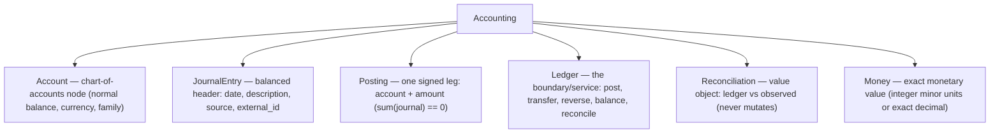

Invariants (enforced, not merely documented):

```text
sum(postings of every journal) == 0
account.balance == opening_balance + sum(postings)   (opening is a posting too)
external bank balance is an Observation; it never mutates the ledger
reconciliation NEVER writes to the ledger
```

### The key modelling shortcut

Sure already has one `Entry` per `Transaction`, and a `Transfer` is already two
`Transaction`s that are equal and opposite. So the ledger can be expressed
**without inventing a parallel schema**:

- `Entry` **becomes the posting**: add `journal_id`; the leg is unchanged.
- `Transaction` **stays the business metadata** (category, merchant, tags, name)
  and attaches to a posting.
- Add a **`JournalEntry`** (`journals` table) that groups the postings of one
  event and carries the balancing rule.
- A deposit becomes:

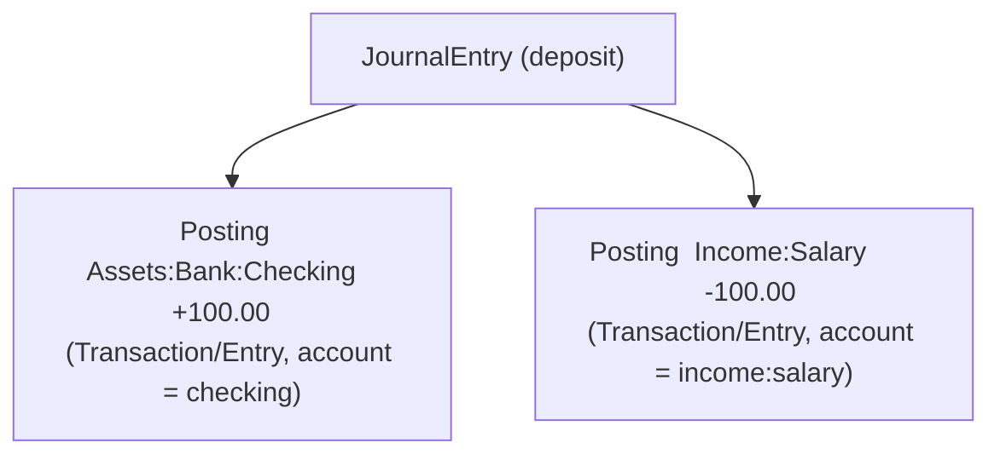

- A transfer becomes:

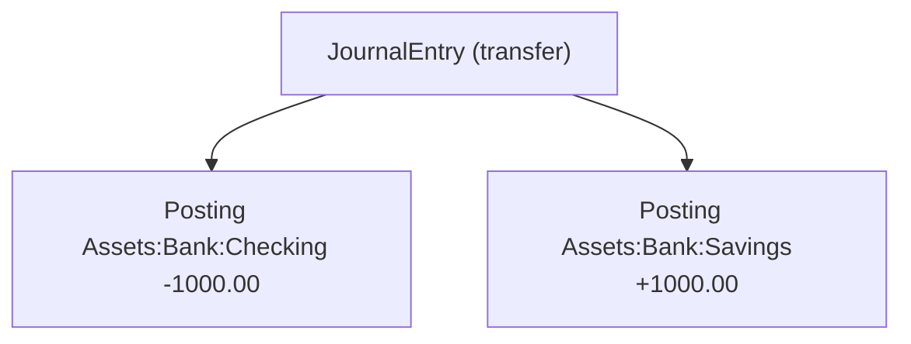

There is **no `Transfer` primitive**. The `transfers` table and
`Transfer`/`RejectedTransfer` models are deleted (see "Code to Remove"), while
detection/matching (`Family::AutoTransferMatchable`) is kept as a helper that
*proposes* a balanced transfer journal.

### Chart of accounts

Sure's `categories` become the **Income/Expense accounts** of the ledger (or, if
we choose to keep them purely as posting metadata, the ledger still needs
synthetic Income/Expense/Equity accounts for balancing). Assets/Liabilities/Equity
accounts are the existing `accounts` rows, augmented with accounting `type`.

Recommended pragmatic split (see `ACCOUNTING_MAPPING.md` for the trade-off):

- `accounts` → Assets / Liabilities / Equity accounts. `accountable_type` maps to
  `Accounting::AccountType` (Depository/CreditCard/... → `assets`/`liabilities`).
- `categories` → Income / Expense accounts **for balancing**, but also remain
  attached to postings as UI metadata. One hidden "Uncategorized" expense account
  and one "Imported/Uncategorized" income account absorb unmatched imports.

This keeps budgets/reports keyed on `category_id` while the ledger balances behind
them.

### Balances

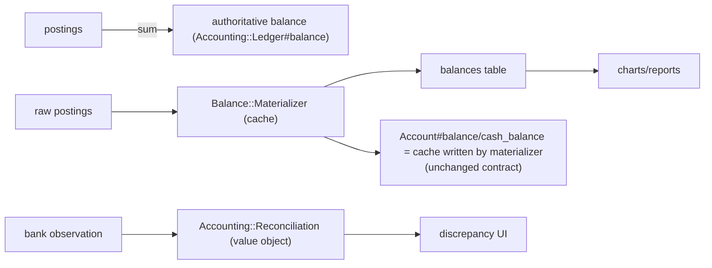

`accounts.balance` and the `balances` table remain as **caches**, rebuilt from
postings instead of from anchors. Consumers (`BalanceSheet`, charts,
`Budget#available_cash`, goals) are untouched.

### Where the boundary goes

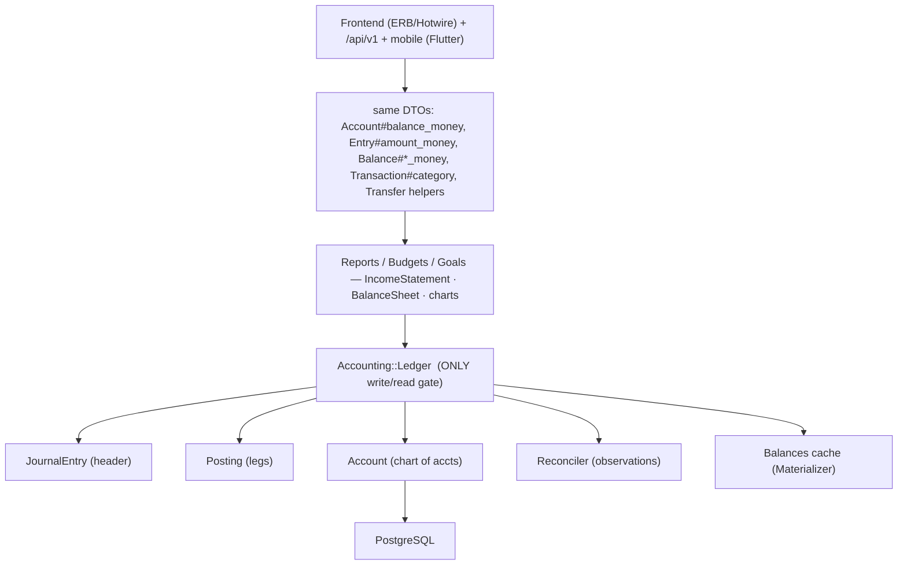

Write path today: `ProviderImportAdapter`, `Transfer::Creator`,
`TransactionsController`, importers, `ReconciliationManager`, `OpeningBalanceManager`.
Each is re-pointed to `Accounting::Ledger.post(...)`.

---

## UI Compatibility

Full per-feature table in `UI_COMPATIBILITY.md`. Summary:

- **UNCHANGED** — accounts list/show, account balance, transaction list/detail,
  splits, categorization, rules, budgets, goals, dashboard, net-worth/cash-flow
  reports, recurring, imports UI, search, mobile (Flutter) and `/api/v1` clients.
- **SMALL_CHANGE** — transfer create/match screens (drop `Transfer` model but keep
  the screen; compute counterpart from the journal), reconciliation valuation
  screens (replace anchor kinds with observation + adjustment journal), and the
  three API leaks (`flows_factor`, valuation `kind`, transfer `kind`).
- **REQUIRES_REDESIGN** — none of the core money screens. The only genuine
  redesign candidate is the **in-app "opening balance / current balance" concept**,
  which is not a user screen but a model the reconciliation UI relies on.

---

## API Compatibility

The `/api/v1` JSON contract (`app/views/api/v1/**/*.json.jbuilder`) can be almost
entirely preserved field-for-field. Required changes:

| Endpoint | Leak | Action |
|---|---|---|
| `GET /api/v1/balances` | serializes `flows_factor` (`balances/_balance.json.jbuilder:6`) | Keep emitting a derived sign, or deprecate the field |
| `GET/POST /api/v1/valuations` | serializes anchor `kind` (`valuations/_valuation.json.jbuilder`) | Map anchor kinds to reconciliation/observation or keep synonyms |
| `GET /api/v1/transfers` | serializes `transfer_type` and `_transaction_side.kind` | Derive from journal instead of `Transfer` row |
| `transactions/_transaction.json.jbuilder:62` | exposes `transfer` object | Derive from the journal's sibling posting |

Everything else (accounts, transactions, budgets, budget categories, cash flow,
balance sheet, categories, holdings, trades, securities, rules) serializes
consumer fields that survive unchanged. `docs/api/openapi.yaml` regeneration is
required only for the changed fields.

---

## Database Design (fresh install)

Minimal new/changed schema:

### New

```text
journals
  id uuid pk
  family_id uuid not null fk
  date date not null
  description text not null
  currency string(3) not null
  source string            -- provider key / 'manual' / 'transfer' / 'opening'
  external_id string       -- idempotency with source
  kind string not null     -- business kind (standard/transfer/...)
  metadata jsonb default {}
  created_at, updated_at
  unique (family_id, source, external_id) where external_id not null and source not null
  index (family_id, date)

postings
  id uuid pk
  journal_id uuid not null fk
  account_id uuid not null fk          -- chart of accounts
  amount decimal(19,4) not null        -- signed; sum per journal == 0
  currency string(3) not null
  created_at, updated_at
  index (journal_id)
  index (account_id, journal_id)
  -- enforce sum == 0 at write time in Accounting::Ledger; optionally a
  -- deferred constraint trigger for defence in depth.

balance_observations              -- external bank balances (facts, not ledger)
  id uuid pk
  account_id uuid not null fk
  amount decimal(19,4) not null
  currency string(3) not null
  observed_at datetime not null
  source string not null            -- plaid/simplefin/manual_statement/...
  kind string not null              -- available/current/statement
  source_id string
  created_at, updated_at
  unique (account_id, source, kind, observed_at)
```

### Reused / adapted

- `accounts` — becomes the chart of accounts; add `account_type` derived from
  `classification` + `accountable_type` (or compute in `Accounting::AccountType`).
  Keep `accountable_type`/`subtype` for the UI. Keep `balance`/`cash_balance` as
  caches.
- `categories` — Income/Expense accounts for balancing; keep as posting metadata
  for UI.
- `balances` — unchanged table; now materialized from postings.
- `transactions` — keep, add `journal_id` (or a `journal_posting_id`), drop
  `transfer_id`.
- `entries` — keep as the posting table, or repoint to `postings`. Because
  consumers have ~dozens of raw SQL joins on `entries`, the lowest-risk variant is
  to **keep `entries` as the posting table** and add `journal_id`; the separate
  `postings` table then becomes optional. See `IMPLEMENTATION_PLAN.md` Phase 1.

Idempotency: reuse `(account_id, source, external_id)` and
`(account_id, idempotency_key)` on the posting table, plus the new
`(family_id, source, external_id)` on `journals`. This preserves provider
re-import protection (`app/models/account/provider_import_adapter.rb:54`).

Currency: postings balance **per journal** in the journal's currency. For true
multi-currency journals, add an `fx_rate`/`base_amount` on postings or balance at
a valuation layer (see Risks, and `ACCOUNTING_BOUNDARY.md`). The default is
single-currency journals, which covers cash, income/expense and same-currency
transfers; cross-currency transfers get a third FX-gain/loss posting.

---

## Import Flow

### Current

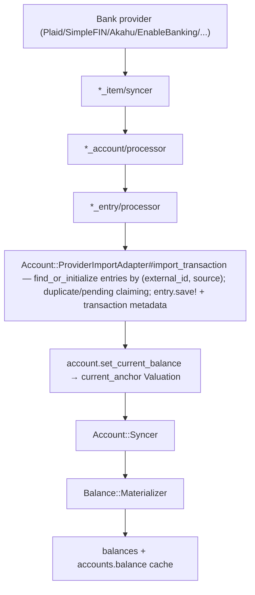

There is **no counter-account** anywhere (`app/models/account/provider_import_adapter.rb:47`;
Spike-1 finding re-verified).

### Proposed

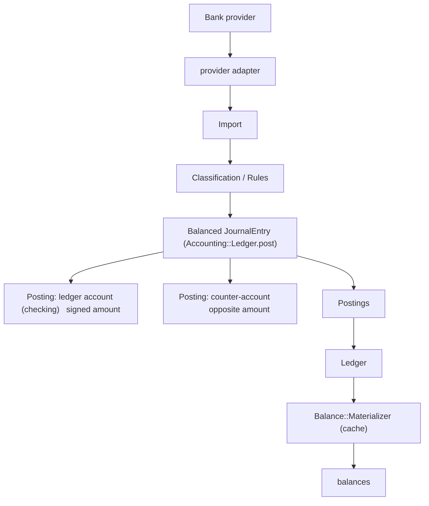

Counter-account selection for imported transactions:

- **Expense** → `Expenses:Uncategorized` (synthetic expense account) until a rule
  or user assigns a real category. The category then becomes the expense account.
- **Income** → `Income:Uncategorized` until classified.
- **Own-account movement** (transfer detected) → the other asset posting.
- **Opening** → `Equity:Opening-Balances` posting.
- **Unknown/ambiguous** → `Assets:Suspense` (clearing), which must be zeroed
  before reports consider the ledger "clean". `Assets:Suspense` is preferred over
  equity because it is an asset, is visible on the balance sheet, and is
  self-clearing when the classification arrives.

Recommendation: use `Expenses:Uncategorized` / `Income:Uncategorized` for normal
unmatched imports (matches Sure's existing "Uncategorized" UX,
`app/models/entry.rb:113`, `app/models/category.rb:236`) and reserve
`Assets:Suspense` strictly for provider rows that cannot be classified at all
(e.g. missing amount sign). `Equity:Opening-Balances` is used only for account
opening balances.

Provider balance figures become `balance_observations` rather than
`current_anchor` valuations; the ledger never moves to match them.

---

## Transfer Flow

### Current

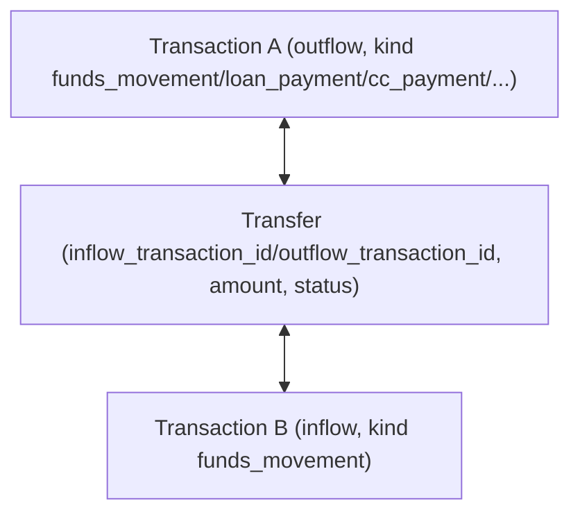

`Transfer.kind_for_account` (`app/models/transfer.rb:20`) derives `kind` from the
destination; `Family#auto_match_transfers!`
(`app/models/family/auto_transfer_matchable.rb:61`) discovers candidates with a
4-day window and FX tolerance; `Transfer::Creator` (`app/models/transfer/creator.rb:28`)
creates manual transfers (including fees and tags).

### Proposed

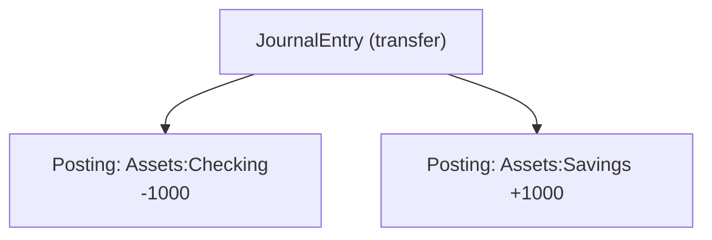

- Delete the `Transfer` accounting primitive; keep detection/matching to *build*
  a balanced transfer journal.
- Keep `Transaction#kind` purely as UI/budget metadata (it already gates budget
  analytics via `BUDGET_EXCLUDED_KINDS`, `app/models/transaction.rb:86`).
- Fees become additional balanced journals (fee expense against the source/dest
  asset), not `fee_transactions` on a Transfer.
- `RejectedTransfer` stays purely as a matching-hint table.

Consumers touched: `Transfer::Creator`, `Family::AutoTransferMatchable`,
`Transaction::Transferable` (`app/models/transaction/transferable.rb`),
`Rule::ActionExecutor::SetAsTransferOrPayment`, `transfers_controller`,
`transfer_matches_controller`, the `transfers` jbuilder partials, and the
`transfers` table. Full list in `ACCOUNTING_MAPPING.md`.

---

## Balance Flow

### Current

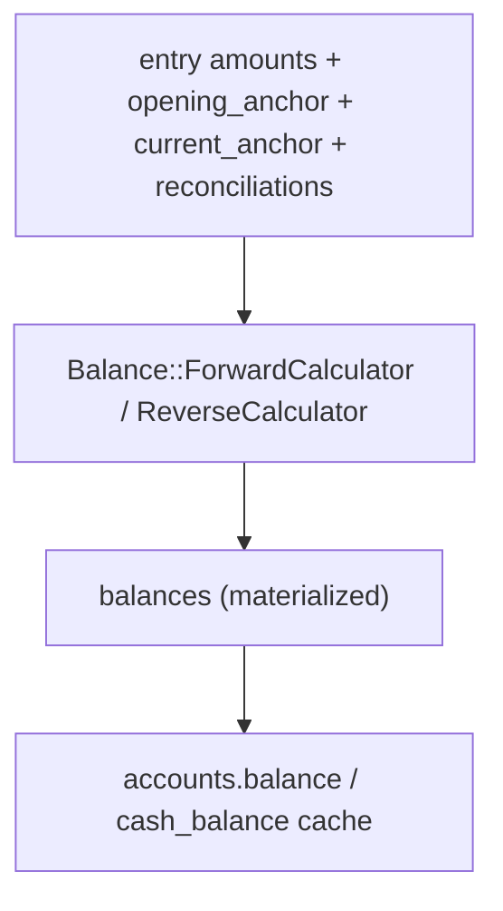

### Proposed

```mermaid
flowchart TD
    postings["postings"] -->|sum(date-filtered)| balance["authoritative balance (Ledger#balance / balance_at)"]
    src["postings + opening postings"] --> mat["Balance::Materializer (cache, unchanged shape)"]
    mat --> balances["balances table"]
    balances --> cache["accounts.balance / cash_balance cache (contract unchanged)"]
    obs["balance_observations"] --> recon["Accounting::Reconciliation(ledger, observed)"]
    recon --> discrepancy["discrepancy"]
```

- Authoritative balance: `SUM(postings)` including the opening posting.
- Optional cache: the existing `balances` table.
- External bank balance: `balance_observations`.
- Reconciliation: `ledger balance vs observed`, never mutating the ledger.
- Fixing a discrepancy requires an explicit correction journal (e.g. an expense
  posting to `Expenses:Bank-Adjustment`).

`Account#balance` / `cash_balance` keep their meaning as caches so
`BalanceSheet::AccountTotals#converted_balance_for`
(`app/models/balance_sheet/account_totals.rb:103`),
`Budget#available_cash`, goals, and `/api/v1/accounts` all continue to work.

---

## Risks

Ranked.

### High

1. **Sign-convention inversion.** Sure stores negative = inflow, positive =
   outflow, and liabilities as positive debt
   (`docs/llm-guides/architecture.md`; `Balance::BaseCalculator#flows_factor`,
   `app/models/balance/base_calculator.rb:70`). The ledger uses debit-positive
   signed postings (`spikes/double_entry/lib/double_entry/account_type.rb`). A
   mechanical translation will flip net worth, budgets and goals. Every write path
   and the materializer must translate through one function, with tests asserting
   net worth and an account balance on both conventions.
2. **Full-history recomputation cost.** Shifting from anchor deltas to posting
   sums means the `balances` cache must be recomputed from the journal for every
   account, and incremental sync logic
   (`Balance::ForwardCalculator#resolve_starting_balances`,
   `app/models/balance/forward_calculator.rb:74`) must still seed correctly.
   Wrong incremental seeds produce silently wrong charts.
3. **Investments / market valuations.** Holdings and `net_market_flows`
   (`db/schema.rb:270`, `app/models/investment_statement.rb:179`) are not
   transactions. Mark-to-market must be an explicit journal posting
   (e.g. `Assets:Investments` against `Equity:Market-Gains`) posted by
   `Holding::Materializer`, or reports diverge from the ledger.

### Medium

4. **Multi-currency balancing.** `sum(postings) == 0` must hold per currency or a
   base/valuation amount is needed. Cross-currency transfers and FX gain/loss
   require an explicit third posting. Sure already has `ExchangeRate` and
   `Money#exchange_to` (`lib/money.rb:49`), so the data exists; the ledger rule
   must be written to match.
5. **Raw-SQL coupling in reports.** `IncomeStatement::ScopedTransactionsQuery`
   (`:27`) joins `entries` and applies `kind` filters. If the projection field set
   changes, these silently return wrong totals. Keep the projection stable or
   update these files atomically.
6. **Category-as-account vs category-as-metadata.** Making categories Income/Expense
   accounts affects budgets, reports and merchant analytics. The safe path is to
   keep `category_id` on postings and use synthetic ledger accounts for balancing.

### Low

7. **`flows_factor`, anchor kinds, and transfer `kind` leaks in `/api/v1` and
   `mobile/`.** Cosmetic contract changes; mobile parses `kind` strings
   (`mobile/lib/services/transfers`/models).
8. **Idempotency semantics** for multi-leg journals
   (`(account_id, source, external_id)` assumes one row per account).
9. **Performance** of posting-sum balances if the cache is bypassed.

---

## Code to Remove

Accounting primitives that disappear (fresh install, so no data concerns):

- `app/models/transfer.rb` — `Transfer`, `Transfer.kind_for_account`, fee helpers.
- `app/models/rejected_transfer.rb` — keep only if retained as a matching hint.
- `db/schema.rb` `transfers` table (`:2752`) and `transactions.transfer_id`
  (`:2740`).
- `app/models/transaction/transferable.rb` (`transfer_as_inflow/outflow`).
- `app/models/transfer/creator.rb` — replaced by `Accounting::Ledger#transfer`.
- `app/models/account/opening_balance_manager.rb`,
  `app/models/account/current_balance_manager.rb`,
  `app/models/account/reconciliation_manager.rb` — replaced by opening postings
  and observation-based reconciliation. (`ReconciliationManager`'s goal-pledge
  hook `GoalPledge::Reconciler` must be re-homed.)
- `app/models/account/anchorable.rb` — opening/current anchor accessors
  (`set_opening_anchor_balance`, `set_current_balance`, `opening_anchor_date`,
  `current_anchor_balance`).
- `app/models/valuation.rb` `opening_anchor`/`current_anchor` kinds (`:4`).
- `Balance::BaseCalculator#flows_factor` and the `flows_factor` column
  (`db/schema.rb:269`, `app/models/balance.rb:7`).
- `Transaction::TRANSFER_KINDS` / `UNCATEGORIZED_EXCLUDED_KINDS` — replaced by
  account-type semantics (carefully; `BUDGET_EXCLUDED_KINDS` is a reporting policy
  and may stay).
- The `transfers` API surface: `app/controllers/api/v1/transfers_controller.rb`,
  `app/views/api/v1/transfers/*`, `rejected_transfers_controller`,
  `spec/requests/api/v1/transfers*`.

## Code to Reuse

- `Account` as the chart node (`app/models/account.rb`), including
  `delegated_type :accountable` (`:107`), scopes, sharing, AASM.
- `Entry`/`Transaction`/`Trade`/`Holding`/`Security`/`SecurityPrice` models and
  their UI metadata.
- `lib/money.rb`, `Monetizable`, `ExchangeRate` + `Provided`.
- Provider item/account/entry processors and the `ProviderImportAdapter` (re-point
  only the persistence call inside it).
- `Import`/`Import::Mapping` pipeline and `*Import` classes.
- `Rule` engine and actions (`app/models/rule/*`).
- `IncomeStatement`, `BalanceSheet`, `Budget`, `Goal`, `RecurringTransaction`,
  `ReportsController`, `PagesController`, all components — unchanged if the
  `entries`/`balances` read models are preserved.
- `Balance::Materializer` and `Balance::*Calculator` — adapted to read postings.
- `/api/v1` jbuilder partials and `docs/api/openapi.yaml` — mostly unchanged.
- `Family`, `User`, `Session`, auth, OAuth/API keys, mobile app, Helm chart.

---

## Implementation Plan

Detailed phases are in `IMPLEMENTATION_PLAN.md`. In brief:

1. New accounting schema (`journals`, posting columns, `balance_observations`).
2. `Accounting::*` domain + ledger invariants + tests.
3. Transaction/posting write API and the manual transaction path.
4. Accounts as chart of accounts (types, opening postings).
5. Imports → balanced journals.
6. Rules → classify postings/counter-accounts.
7. Transfers → balanced journals; delete `Transfer`.
8. Balances → derive from postings; keep `balances` as cache.
9. Reconciliation → observations, never mutate the ledger.
10. Reports/budgets/goals re-pointed where needed.
11. Investments/FX (mark-to-market postings, FX gain/loss).

---

## Final Questions

### 1. Can we keep the existing Sure UI?

**MOSTLY YES.** The web UI reads money through facades
(`Account#balance_money`, `Entry#amount_money`, `Balance#*_money`,
`Transaction#category`, `Transfer` helpers), not through the storage model
(`app/views/api/v1/accounts/_account.json.jbuilder:8`,
`app/models/balance_sheet/account_totals.rb:103`,
`app/components/UI/account/balance_reconciliation.rb`). Keeping those facades on
top of a posting-derived cache leaves accounts, transactions, budgets, goals,
reports and dashboard visually unchanged. The only screens needing work are
transfer create/match and reconciliation/normalization screens.

### 2. Can we keep the existing API?

**MOSTLY YES.** `/api/v1` is jbuilder over consumer fields; the leaks are
`flows_factor` (`balances/_balance.json.jbuilder:6`), valuation anchor `kind`,
and transfer `kind`/`transfer_type`. Those are **SMALL_CHANGE** and can be emitted
as derived, backward-compatible values.

### 3. Can we replace the accounting engine without rewriting Sure?

**MOSTLY YES.** The consumer layer is already decoupled behind
`Account`/`Entry`/`Balance` facades and `IncomeStatement`/`BalanceSheet`. The
rewrite is confined to the write paths and balance/anchors machinery. The
residual work is re-expressing the `entries`/`balances` read models as postings
projections so the raw-SQL consumers stay valid.

### 4. What percentage of the existing Sure code can realistically remain?

**Qualitative: the large majority — conservatively ~70–80% of accounting-related
code, and ~90%+ of non-accounting code.** This is derived from the dependency map:
only the models/services/tables listed under "Code to Remove" and the raw-SQL
seams need altering; `Rule`, `Import`, `Budget`, `Goal`, `IncomeStatement`,
`BalanceSheet`, provider items, auth, mobile, and all views remain. Precision is
not claimed: the exact number depends on how the `entries` projection is shaped.

### 5. Minimum set of components that must be rewritten

- `app/models/entry.rb` / `app/models/entryable.rb` (posting semantics).
- `app/models/transaction.rb` (kind → account semantics; remove transfer linkage).
- `app/models/transfer.rb`, `app/models/transfer/creator.rb`,
  `app/models/transaction/transferable.rb`.
- `app/models/valuation.rb` and the three `Account::*BalanceManager`/`Anchorable`
  classes.
- `app/models/balance/base_calculator.rb`, `forward_calculator.rb`,
  `reverse_calculator.rb`, `materializer.rb` (read postings, not anchors).
- `app/models/account/provider_import_adapter.rb` (post balanced journals).
- `app/controllers/transactions_controller.rb` + API transactions controller
  (create the counter-posting).
- `app/models/transaction_import.rb` and CSV/QIF/PDF importers.
- New `app/models/accounting/*`.

### 6. What can be deleted?

See "Code to Remove": `Transfer`/`RejectedTransfer`, `Transfer::Creator`,
`Transaction::Transferable`, the anchor managers, `Anchorable`, the
`transfers` table, `transactions.transfer_id`, `flows_factor`, anchor valuation
kinds, and the `/api/v1/transfers` surface.

### 7. Three biggest technical risks (ranked)

1. Sign-convention inversion (negative = inflow, positive debt liabilities).
2. Reliable full/incremental recomputation of posting-derived balances at scale.
3. Investments/market valuation and multi-currency balancing under
   `sum(postings) == 0`.

### 8. Smallest proof-of-concept implementation

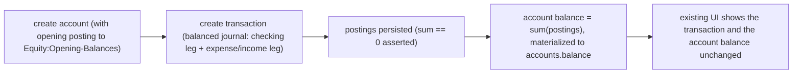

Plus one import and one transfer journal, and one reconciliation observation —
the MVP in `IMPLEMENTATION_PLAN.md` Phase 0/1.

### 9. Is a fresh-install fork significantly easier than migrating existing data?

**YES, decisively.** Because there is no data to preserve, the schema can be
redesigned freely (drop `transfers`, `flows_factor`, anchor kinds) — no backfill,
no dual-write, no old/new balance reconciliation, no legacy conversion. Only the
*write paths* and the *read-model derivation* need building; the expensive and
risky migration of Spike 1 disappears entirely.

### 10. Final recommendation

**PROCEED WITH CAUTION.**

The accounting core (accounts, signed legs, currencies, imports,
rules, reports) is already the right shape, and the UI/API can be preserved. The
fresh-install constraint removes the hardest half of Spike 1. The caution is
concrete: the sign convention, the balance recomputation, and
investments/FX must be solved with explicit tests **before** the `Transfer`
primitive and anchor managers are deleted, and the raw-SQL reporting seams must be
kept green at every step.
